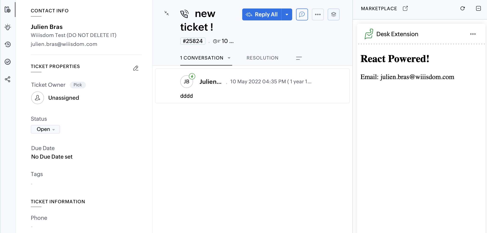

# Zoho Desk Extension Template: React + Typescript

This repository is showing you an example of a [Zoho Desk Extension](https://www.zoho.com/desk/extensions/guide/introduction.html) with [React 18](https://react.dev) and [TypeScript 5](https://www.typescriptlang.org).

## Why?

We are working at [Wiiisdom](https://wiiisdom.com) with Zoho Desk and we decided to invest in an extension to simplify the life of our support team. We have some trouble with the initial setup of React + TypeScript, and we think that it can be useful for some other folks!

## How to develop with this template?

You can follow the guide [here](https://www.zoho.com/desk/extensions/guide/test-extension.html), but in a nutshell:

```
yarn # install deps
zet run # run locally
```

And then be sure to activate the Developer mode on Zoho Desk side.



## How to pack the extension for a release?

```
zet pack
```

## Technical information

- This extension is relying on `ts-loader` in the webpack configuration to read the `tsx`/`ts` files.
- The `ZOHODESK` object type is declared in `globals.d.ts`. Extend it if you need!
- components are located in `src/components`, see the basic `App.tsx`
- a basic test is build in `test/components`, it is relying on `vitest`.

## License

This template is available under the MIT license.

## Author

- Julien Bras <julien.bras@wiiisdom.com>
